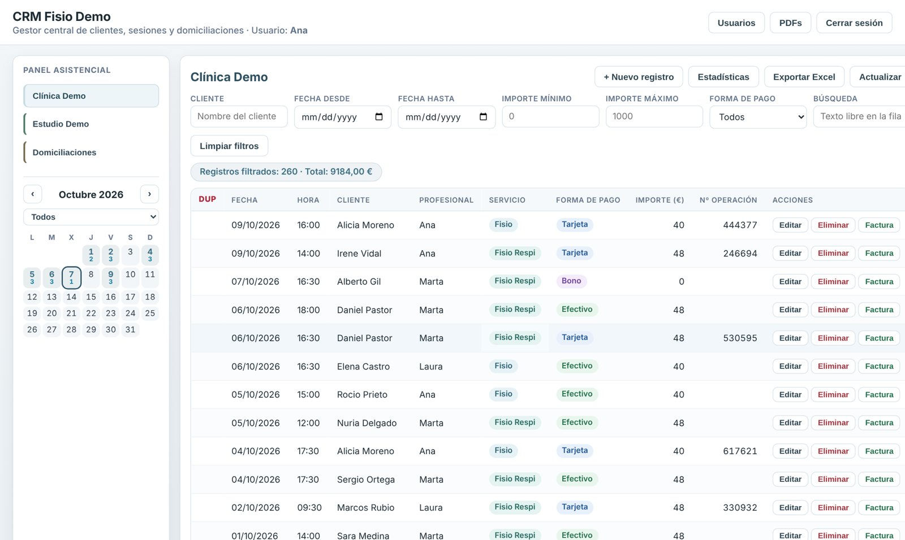
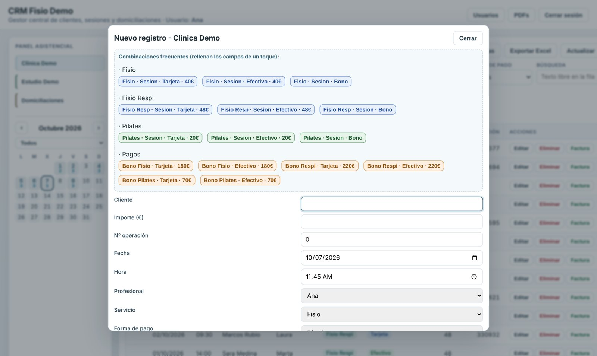
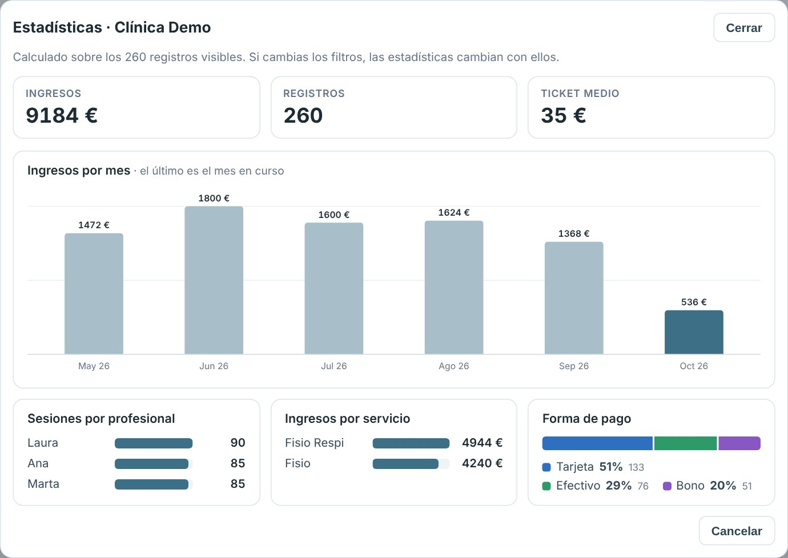
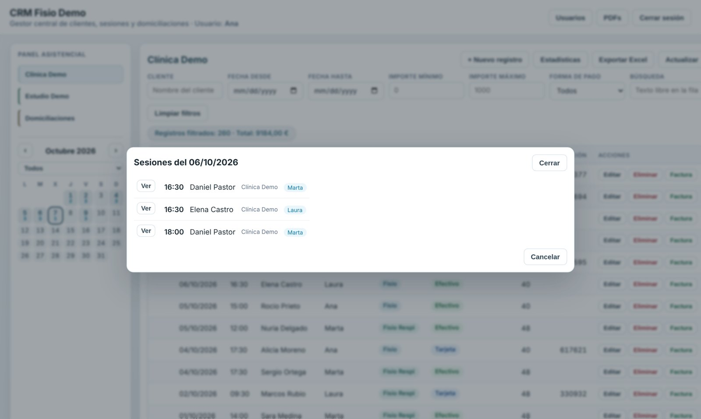
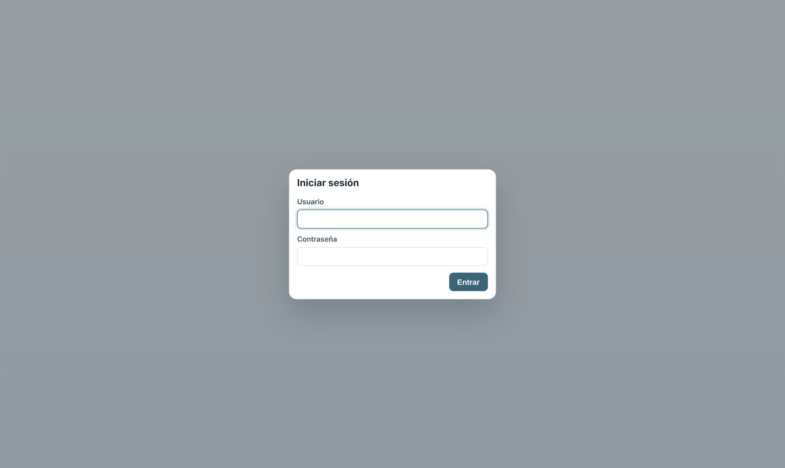

# CRM Fisio Demo


Versión de demostración de un CRM que desarrollé como proyecto personal, para aprender,
para un pequeño negocio familiar de fisioterapia y pilates que lo usa a diario. Sustituye el
registro manual de sesiones y cobros en hojas de cálculo por una aplicación web con usuarios,
roles y auditoría.

> **Todos los datos de este repositorio son ficticios.** Nombres del centro, profesionales,
> clientes, precios e identificadores se han sustituido por valores inventados. Es una copia
> de demostración independiente de la aplicación en uso.

---

## Por qué Apps Script

Toda la aplicación está hecha solo con Google: **Apps Script** como backend y **Google Sheets**
como base de datos, sin servidores ni coste de hosting. Es un ejemplo de que con Apps Script se
puede construir algo muy funcional, no solo macros:

- `HtmlService` sirve la interfaz web.
- `SpreadsheetApp` lee y escribe los datos.
- `CacheService` guarda las sesiones con caducidad.
- `PropertiesService` almacena los usuarios.
- `LockService` evita que dos personas escriban a la vez.

Además, un script complementario (en un proyecto aparte, no incluido aquí) se ejecuta con un
activador temporal a final de mes y envía por correo la contabilidad mensual.

## Qué resuelve

Antes, cada profesional apuntaba sesiones y cobros directamente en una hoja de Google: datos
duplicados, importes vacíos, sin control de quién cambiaba qué. La aplicación pone una capa
web encima de esas hojas que valida, controla accesos y deja rastro de cada cambio.

## Funcionalidades

- **Login propio** con usuario y contraseña (hash SHA-256 con sal) y sesiones con caducidad.
- **Roles:** `admin` ve todos los módulos; `fisio` solo los suyos y, opcionalmente, solo sus filas.
- **Tres módulos** sobre hojas distintas: clínica, estudio de pilates y domiciliaciones.
- **Alta y edición de registros** con validaciones en cliente y servidor (importe numérico,
  cliente obligatorio, número de operación en pagos con tarjeta).
- **Detección de duplicados** al guardar y limpieza en bloque.
- **Plantillas rápidas** (fisio, pilates, bonos) que rellenan el formulario en un clic.
- **Calendario de sesiones** en el panel lateral: cada día muestra cuántas sesiones hay y, al pulsarlo, el detalle con hora, cliente, centro y profesional. Se puede filtrar por centro.
- **Estadísticas** del módulo: ingresos, registros y ticket medio; ingresos por mes; sesiones por profesional; ingresos por servicio y reparto por forma de pago. Se calculan sobre los registros filtrados y se dibujan en SVG, sin librerías externas.
- **Facturas en PDF** generadas desde un registro, con IVA e IRPF.
- **Exportación a Excel** de la vista filtrada, con totales.
- **Auditoría:** cada alta, edición o borrado queda en una hoja `Auditoria` con los datos antes y después.
- **Registro de accesos** (`Log_Sesiones`) con resultado de cada intento de login.
- **Escrituras con bloqueo** (`LockService`) para evitar conflictos entre usuarios simultáneos.

## Capturas

Interfaz de la aplicación con los datos ficticios de la demo.

**Registros con filtros, totales y etiquetas por servicio y forma de pago**



**Alta de registro con plantillas rápidas y validaciones**



**Estadísticas: ingresos por mes, sesiones por profesional, ingresos por servicio y forma de pago**



**Calendario de sesiones: cada día muestra cuántas hay y, al pulsarlo, el detalle por profesional**



**Inicio de sesión con usuario propio**



---

## Arquitectura

```text
Navegador ──▶ Web App (Apps Script, doGet)
                 │
                 ├─ auth.js            login, sesiones, roles
                 ├─ app.js             API: registros, facturas, export, calendario
                 ├─ services/          acceso a hojas por módulo, auditoría, log de accesos
                 └─ Google Sheets      una hoja por módulo (+ Auditoria, Log_Sesiones)
```

```text
src/
├── Config.js              Módulos, usuarios iniciales e IDs de hojas
├── auth.js                Autenticación y control de sesión
├── app.js                 Funciones expuestas al cliente
├── demoSeed.js            Genera hojas de demo con datos ficticios
├── server/routes.js       doGet y renderizado
├── services/              Servicios por módulo, auditoría y log de accesos
├── common/utils.js        Utilidades compartidas
└── index.html, client.html, styles.html   Frontend (HTML + JS + CSS)
```

## Probar la demo

Requisitos: Node.js y `clasp` (`npm i -g @google/clasp`).

```bash
clasp login
clasp create --type webapp --title "CRM Fisio Demo" --rootDir src
clasp push
```

1. En el editor de Apps Script, ejecuta `crearDatosDemo`. Crea tres hojas con datos inventados
   y muestra sus IDs en el registro de ejecución.
2. Pega esos IDs en `SHEETS` dentro de `src/Config.js` y vuelve a hacer `clasp push`.
3. Despliega como aplicación web (`clasp deploy`) y entra con:

| Usuario | Contraseña | Rol |
| ------- | ---------- | --- |
| `admin` | `demo1234` | Administrador, todos los módulos |
| `laura` | `demo1234` | Fisio, solo clínica y solo sus registros |

## Stack

Google Apps Script (V8) · Google Sheets · HTML/CSS/JavaScript · clasp · ESLint · GitHub Actions

En la versión en uso, el despliegue a producción y a un entorno de desarrollo se hace con
GitHub Actions y `clasp`, con las credenciales guardadas como secretos del repositorio.
En esta demo el workflow solo ejecuta el lint.
